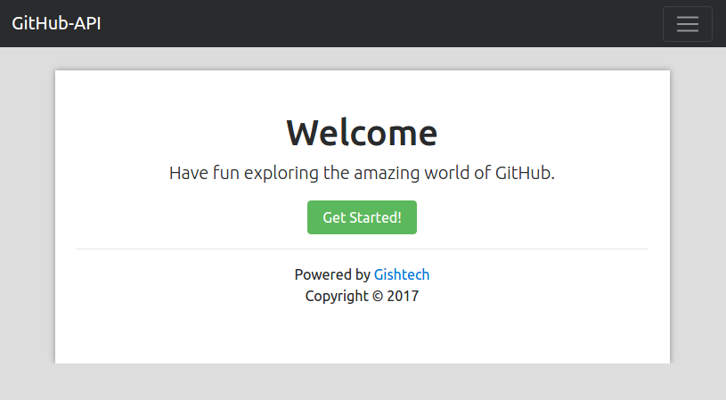
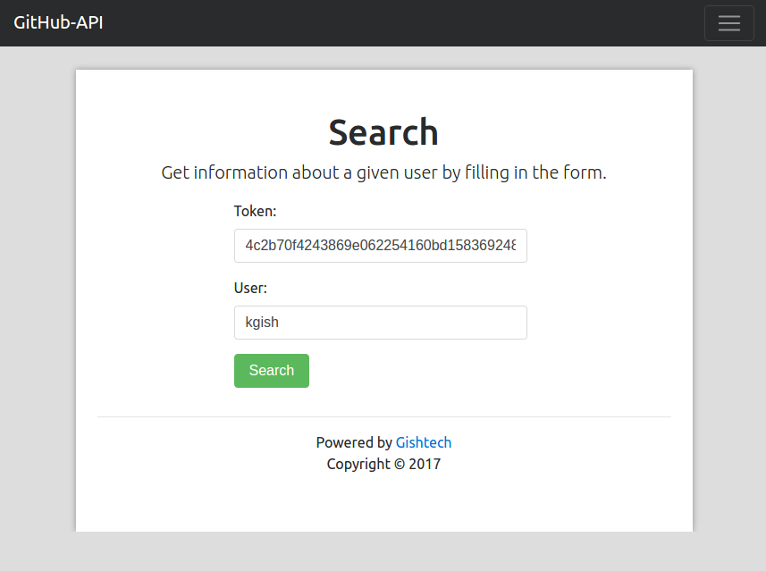
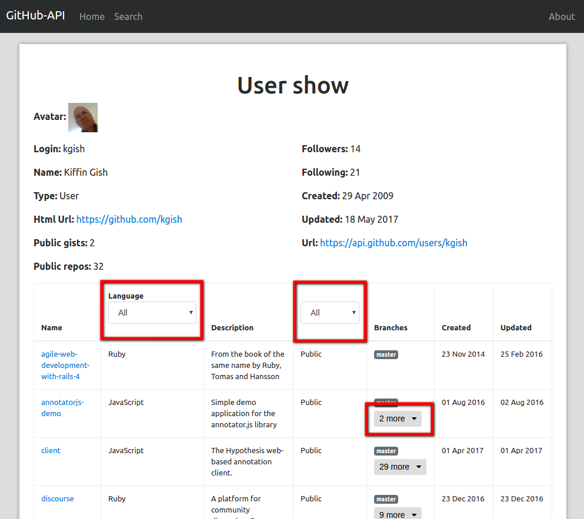

# GitHub-API

A basic [Emberjs](http://emberjs.com/) demo application demonstrating how to use the [GitHub API v3](https://developer.github.com/v3/) to access information about user repositories.

Screenshot of the homepage:


## Demo

If you prefer not to have to go through all of the installation, I've deployed the application to Heroku and it can be viewed at https://github-api-demo.herokuapp.com.

## Prerequisites

You will need the following things properly installed on your computer.

* [Git](https://git-scm.com/)
* [Node.js](https://nodejs.org/) (with NPM)
* [Ember CLI](https://ember-cli.com/)
* [PhantomJS](http://phantomjs.org/)


## Installation

The installation is straight forward and according to the Ember way:

```
$ git clone git@github.com:kgish/github-api.git
$ cd github-api
$ npm install && bower install
```


## Token

I use the [ember-cli-dotenv](https://github.com/fivetanley/ember-cli-dotenv) addon for storing secret data and then having it injected into the application environment.

You will need to acquire a [personal access token](https://github.com/settings/tokens) (scope repo) and add this value to the `.env` file.

```
GITHUB_API_TOKEN=xxxxxxxxxx
```

Don't forget to restart the application whenever you change this value.

You can also just enter a token directly in the search dialog if you do not want to have to change the `.env` file every time.

Important: if it happens that you start receiving 403 Authorization Failed errors, then it is likely that the token is no longer valid and you will need to create a new token.


## Test

The complete test suite can be executed in one go by running the following command:

```
$ ember test
```

or if you just want to run a specific test, e.g. the acceptance test for search:

```
$ ember test -f 'Acceptance | search page'
```


## Run

Fire up the application by running the following command:

```
$ ember serve
```

and then point your favorite browser to: [http://localhost:4200](http://localhost:4200).


## Build

If you choose to build the application for a specific environment, run this command:

```
$ ember build --environment={development|test|production}
```

## GitHub API Adapter

I use [Ember Data Github](https://github.com/elwayman02/ember-data-github) for making request to the GitHub API endpoint `api.github.com`

In order to use the token, I inject the token value into the `github-session` service when the search request is initiated.

The `UsersSearchController` looks like this:

```
import Ember from 'ember';
import ENV from 'github-api/config/environment';

export default Ember.Controller.extend({

    session: Ember.inject.service('github-session'),

    token: ENV.APP.GITHUB_API_TOKEN,
    user: null,

    ...

    actions: {
        submit() {
            let session = this.get('session'),
                user = this.get('user'),
                token = this.get('token');

            session.set('githubAccessToken', token);
            this.transitionToRoute('users.show', user);
        }
    }
});
```


Screenshot of the search page:



## Bootstrap

For the styling and UI components I used the newest version of [Bootstrap v4-alpha](https://v4-alpha.getbootstrap.com/) which provides many new attractive functionalities.


## Error handling

For nicer boostrap-like alerts, I use [bootbox](https://github.com/makeusabrew/bootbox). If a server error is detected, the appropriate error message is displayed.

This is done by hooking into the `error` action in `UsersShowRoute`:

```
actions: {
    error(error) {
        let errors = [];
        error.errors.forEach(error => {
            errors.push(`${error.status} : ${error.title}`);
        });
        bootbox.alert({
            size: "small",
            title: "An error has occurred",
            message: errors.join('<br/>'),
            callback: function(){ /* your callback code */ }
        });
        return true;
    }
}
```

## Results page

For a successful search, you will be brought to the results page which will display the general information. If the user has any repositories, these will be listed in a table below. There is a dropdown for `language` and `private` in order to filter the table list. Also if the given repository has multiple branches, these can be viewed by clicking on the `more`-button.

Screenshot of the results page:



## Additional Addons

In order to enhance this application, I used the following extra addons in the `package.json` file:

```
"devDependencies": {
    ...
    "ember-cli-dotenv": "^1.2.0",
    "ember-cli-sass": "^6.1.3",
    "ember-data-github": "^0.3.1",
    "ember-font-awesome": "^3.0.5",
    "ember-truth-helpers": "^1.3.0",
    "emberx-select": "^3.0.1",
    ...
},
```


## Bower

Extra stuff using bower in the `bower.json` file:

```
"dependencies": {
    "font-awesome": "fontawesome#^4.7.0",
    "bootstrap": "4.0.0-alpha.6",
    "moment": "^2.18.1"
}
```

## Deploy

My cloud platform of choice is [Heroku](https://www.heroku.com/home) and these are the commands I executed in order to deploy the application.

```
$ heroku create github-api-demo
$ heroku buildpacks:add https://codon-buildpacks.s3.amazonaws.com/buildpacks/heroku/emberjs.tgz
$ heroku config:set GITHUB_API_TOKEN=xxxxxx
$ git push heroku master
$ heroku open
```

The application can be seen at https://github-api-demo.herokuapp.com.

## Code quality

To ensure the highest possible code quality, and also prevent bugs as much as possible, the following were used:

* [ES6](https://github.com/lukehoban/es6features) transpiled by [Babel](https://babeljs.io)
* [ESLint](http://eslint.org/)
* [Editorconfig](http://editorconfig.org/)
* [Stylelint](https://stylelint.io/)
* [PhantomJS](http://phantomjs.org/) under [QUnit](https://qunitjs.com/)


## References

* [Ember.js](http://emberjs.com/)
* [Ember-CLI](https://ember-cli.com/)
* [GitHub API v3](https://developer.github.com/v3/)
* [Ember Data Github](https://github.com/elwayman02/ember-data-github)
* [Ember-cli-dotenv](https://github.com/fivetanley/ember-cli-dotenv)
* [Bootstrap v4-alpha](https://v4-alpha.getbootstrap.com)
* [FontAwesome](http://fontawesome.io/icons)
* [Deploy Ember to Heroku](https://www.heroku.com/emberjs)


## Author

Kiffin Gish \< kiffin.gish@planet.nl \>

[Gishtech](http://gishtech.com)  
Advanced Software Development for the Web

"You're never too old to learn new stuff..."
